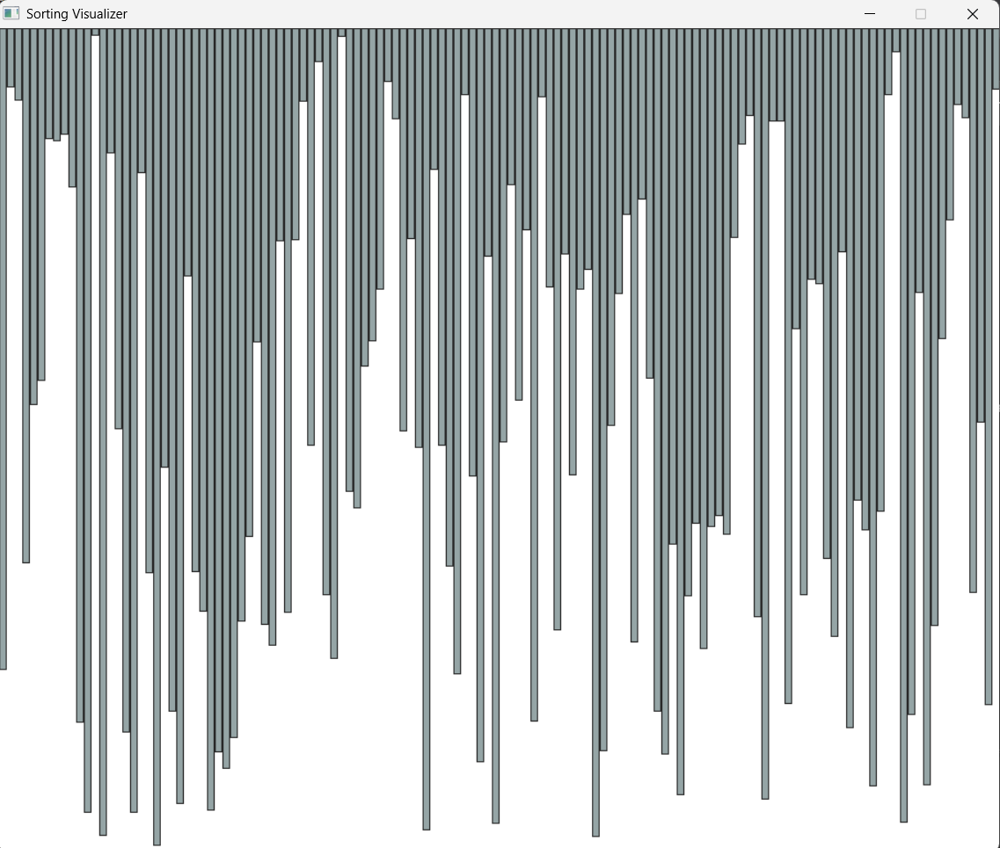
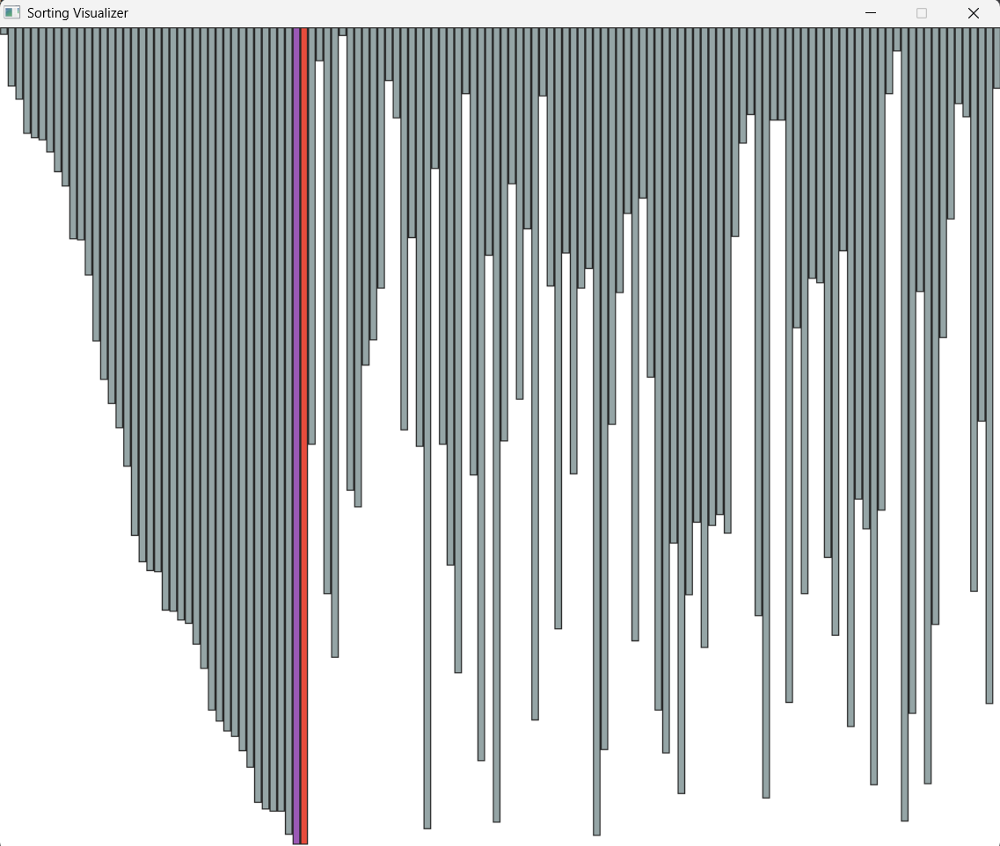

# Sorting Visualizer

A desktop application that visually demonstrates how different sorting algorithms work using animated bars.
Built for students, educators, and anyone interested in understanding sorting algorithms in an intuitive and interactive way.

## 🚀 Features

- Visual representation of 6 classic sorting algorithms
- Light-themed UI with smooth animations
- Color-coded comparisons, swaps, and sorted bars
- Outlined bars for improved visual clarity
- Adjustable array size and delay (via source code)


## Run Locally

Clone the project

```bash
  git clone https://github.com/saurabhkumargit/sortingvisualizer.git
```

Go to the project directory

```bash
  cd sortingvisualizer
```

Compile using g++

```bash
  g++ "Sorting Visualizer.cpp" ^
 -IC:\Path\To\SDL2\include\SDL2 ^
 -LC:\Path\To\SDL2\lib ^
 -lmingw32 -lSDL2main -lSDL2 -o SortingVisualizer.exe

```

Copy SDL2.dll into the same directory:

```bash
  copy C:\Path\To\SDL2\bin\SDL2.dll .
```

Run the application:

```bash
SortingVisualizer.exe
```
## 🧱 Tech Stack


**Language:**  
- C++17

**Libraries:**  
- SDL2 (v2.28.5)

**Platform:**  
- Windows (MinGW-w64)

**Editor:**  
- Visual Studio Code (recommended)
## 📜 License

This project is licensed under the [MIT License](LICENSE).

## 📸 Demo

Here's a glimpse of the Sorting Visualizer in action:


*Initial unsorted array*


*Bars moving during sorting*
